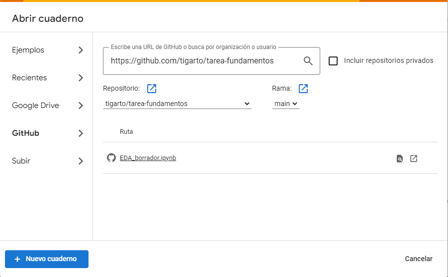

# tarea-fundamentos

Para abrir el repo en colab hacer lo siguiente: https://colab.research.google.com/ abrir el repo de **github** en **tigarto/tarea-fundamentos** seleccionando en github:
* Archivo > Abrir cuaderno > https://github.com/tigarto/ 

Ver imagen:

